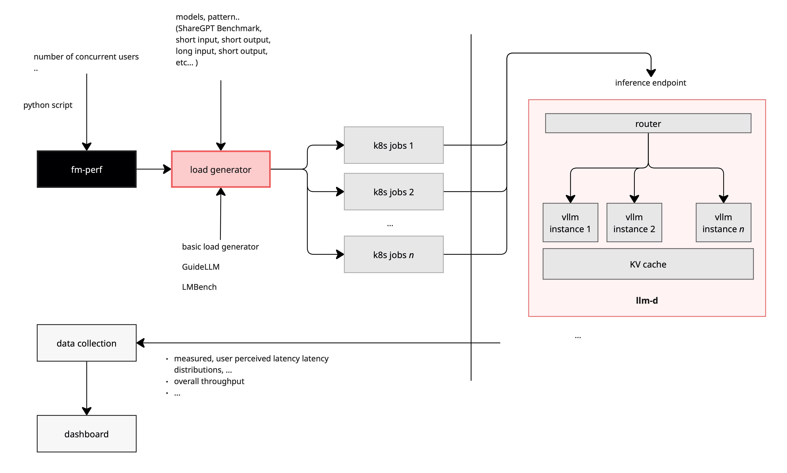

# Benchmark deploy, execution, data collection, analysis and teardown

## `llm-d`-benchmark

This repository provides an automated workflow for benchmarking LLM inference using the llm-d stack. It includes tools for deployment, experiment execution, data collection, and teardown across multiple environments and deployment styles.

### Goal

To provide a single source of automation for repeatable and reproducible experiments and performance evaluation on llm-d

### Architecture

The benchmarking system drives synthetic or trace-based traffic into an llm-d-powered inference stack, orchestrated via Kubernetes. Requests are routed through a scalable load generator, with results collected and visualized for latency, throughput, and cache effectiveness.

<p align="center">
  <picture>
    <source media="(prefers-color-scheme: dark)">
    
  </picture>
</p>


### Main concepts (identified by specific directories)

#### Scenarios

Pieces of information identifying a particular cluster, GPU model, llm model and llm-d parameters (an environment file, and optionally a "values.yaml" file for llm-d-deployer)

#### Harness

Load Generator (python code), written using software facilites available at https://github.com/fmperf-project/fmperf. IMPORTANT: it will be expanded with additional load generators in the future)

#### Workload

FMPerf workload specification, with load profile (e.g., `share-gpt` vs `long-input`) and load levels (e.g., QPS values). IMPORTANT: these definitions will be expanded with specifications to other load generators

#### The triple `<scenario>`,`<harness>`,`<workload>`, combined with the standup/teardown capabilities provided by llm-d-deployer (https://github.com/llm-d/llm-d-deployer) should provide enough information to allow an experiment to be reproduced

### Dependecies:
- llm-d-deployer (https://github.com/llm-d/llm-d-deployer)
- fm-perf: https://github.com/fmperf-project/fmperf

### 📦 Repository Setup
```
git clone https://github.com/llm-d/llm-d-benchmark.git
cd llm-d-benchmark
```

### Quickstart

#### Standing up llm-d for experimentation and benchmarking
```
export LLMDBENCH_CLUSTER_HOST="https://api.fmaas-platform-eval.fmaas.res.ibm.com"
export LLMDBENCH_CLUSTER_TOKEN="..."
export LLMDBENCH_CLUSTER_NAMESPACE="..."
```
#### IMPORTANT: in case you want to simply use the current context, just set `export LLMDBENCH_CLUSTER_HOST=auto`

### A complete list of available variables (and its default values) can be found by running
 `cat setup/env.sh | grep "^export LLMDBENCH_" | sort`

#### list of steps
```
./setup/standup.sh -h
```

#### to dry-run
```
./setup/standup.sh -n
```

### VLLMs can be deployed by one of the following methods:
* #### "standalone" (a simple deployment with services associated to the deployment)
* #### "deployer" (invoking \"llm-d-deployer\").
#### This is controlled by the environment variable LLMDBENCH_DEPLOY_METHODS (default "deployer")
#### The value of the environment variable can be overriden by the paraemeter `-t/--types` (applicable for both `teardown.sh` and `standup.sh`)

#### All available models are listed and controlled by the variable `LLMDBENCH_DEPLOY_MODEL_LIST`
#### The value of the above mentioned environment variable can be overriden by the paraemeter `-m/--model` (applicable for both `teardown.sh` and `standup.sh`)

### Scenarios
#### All relevant variables to a particular experiment are stored in a "scenario" (folder aptly named).
#### The expectation is that an experiment is run by initially executing :

```
source scenario/<scenario name>
```

### At this point, with all the environment variables set (tip, `env | grep ^LLMDBENCH_ | sort`) you should be ready to deploy and test
```
./setup/standup.sh
```

### IMPORTANT: the scenario can be indicated as part of the command line optios for `standup.sh`

#### to re-execute only individual steps (full name or number)
```
./setup/standup.sh --step 07_smoketest.sh
./setup/standup.sh -s 7
./setup/standup.sh -s 3-5
./setup/standup.sh -s 5,7
```

### Once llm-d is fully deployed, an experiment can be run
```
./run.sh
```
### IMPORTANT: the scenario can be indicated as part of the command line optios for `run.sh`

```
./run.sh -c ocp_H100MIG_deployer_llama-8b
```

### Finally, cleanup everything
```
./setup/teardown.sh
```
