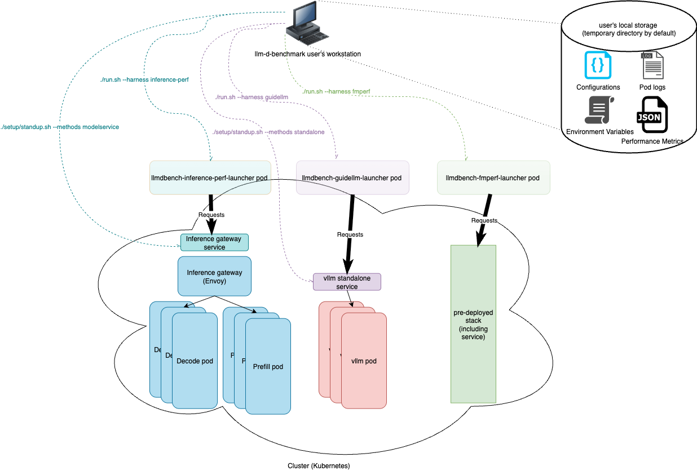

## `llm-d`-benchmark

This repository provides an automated workflow for benchmarking LLM inference using the `llm-d` stack. It includes tools for deployment, experiment execution, data collection, and teardown across multiple environments and deployment styles.

### Main Goal

Provide a single source of automation for repeatable and reproducible experiments and performance evaluation on `llm-d`.

### 📦 Repository Setup

```
git clone https://github.com/llm-d/llm-d-benchmark.git
cd llm-d-benchmark
./setup/install_deps.sh
pip install ./config_explorer
```

## Quickstart

**Out of the box:** **`standup`** a `llm-d` stack (default method is `llm-d-modelservice`, serving `meta-llama/Llama-3.2-1B-Instruct` model), **`run`** a harness (default `inference-perf`) with a load profile (default `sanity_random`) and then **`teardown`** the deployed stack.

```
./e2e.sh
```

> [!TIP]
> The penultimate line on the output, starting with "ℹ️   The current work dir is" will indicate the current path for the generated standup files and collected performance data.

The same above example could be explicitly split in three separate parts.

```
./setup/standup.sh
./run.sh
./setup/teardown.sh
```

A user can elect to  **`standup`** an `llm-d` stack once, and then **`run`** the `inference-perf` harness with a different load profile (i.e., `chatbot_synthetic`)

```
./run.sh --harness inference-perf --workload chatbot_synthetic --methods <a string that matches a inference service or pod>`
```

> [!TIP]
> `./run.sh` can be used to run a particular workload against a pre-deployed stack (`llm-d` or otherwise)

### Architecture

`llm-d-benchmark` stands up a stack (currently, both `llm-d` and "standalone" are supported) with a specific set of [Standup Parameters](docs/standup.md), and the run a specific harness with a specific set of [Run Parameters](docs/run.md). Results are saved in the native format of the [harness](docs/run.md#harnesses) chosen, as well as a universal [Benchmark Report](docs/benchmark_report.md).

<p align="center">
  <picture>
    <source media="(prefers-color-scheme: dark)">
    
  </picture>
</p>

### Goals

#### [Reproducibility](docs/reproducibility.md)

Each benchmark run collects enough information to enable the execution on different clusters/environments with minimal setup effort.

#### [Flexibility](docs/flexibility.md)

Multiple load generators and multiple load profiles available, in a plugable architecture that allows expansion.

#### Well defined set of [Metrics](docs/run.md#metrics)

Define and measure a representative set of metrics that allows not only meaningful comparisons between different stacks, but also performance characterization for different components.

#### Relevant collection of [Workloads](docs/run.md#workloads)

Define a mix of workloads that express real-world use cases, allowing for `llm-d` performance characterization, evaluation, stress investigation.

### Design and Roadmap

`llm-d-benchmark` follows the practice of its parent project (`llm-d`) by having also it is own [Northstar design](https://docs.google.com/document/d/1DtSEMRu3ann5M43TVB3vENPRoRkqBr_UiuwFnzit8mw/edit?tab=t.0#heading=h.9a3894cbydjw) (a work in progress)

### Main concepts (identified by specific directories)

#### [Scenarios](docs/standup.md#scenarios)

Pieces of information identifying a particular cluster. This information includes, but it is not limited to, GPU model, large language model, and `llm-d` parameters (an environment file, and optionally a `values.yaml` file for modelservice helm charts).

#### [Harnesses](docs/run.md#harnesses)

A "harness" is a load generator (Python code) which drives the benchmark load. Today, llm-d-benchmark supports [fmperf](https://github.com/fmperf-project/fmperf), [inference-perf](https://github.com/kubernetes-sigs/inference-perf), [guidellm](https://github.com/vllm-project/guidellm.git), the benchmarks found on the `benchmarks` folder on [vllm](https://github.com/vllm-project/vllm.git), and "no op" (internally designed "nop") for users interested in benchmarking mostly model load times. There are ongoing efforts to consolidate and provide an easier way to support different load generators.

#### (Workload) [Profiles](docs/run.md#profiles)

A (workload) profile is the actual benchmark load specification which includes the LLM use case to benchmark, traffic pattern, input / output distribution, and dataset. Supported workload profiles can be found under [`workload/profiles`](./workload/profiles).

> [!IMPORTANT]
> The triplet `<scenario>`,`<harness>`,`<(workload) profile>`, combined with the standup/teardown capabilities provided by [llm-d-infra](https://github.com/llm-d-incubation/llm-d-infra.git) and [llm-d-modelservice](https://github.com/llm-d/llm-d-model-service.git) should provide enough information to allow a single experiment to be reproduced.

#### [Experiments](docs/doe.md)
A file describing a series of parameters - both `standup` and `run` - to be executed automatically. This file follows the "Design of Experiments" (DOE) approach, where each parameter (`factor`) is listed alongside with the target values (`levels`) resulting into a list of combinations (`treatments`).

#### [Configuration Exploration](config_explorer/README.md)
The configuration explorer is a library that helps find the most cost-effective, optimal configuration for serving models on llm-d based on hardware specification, workload characteristics, and SLO requirements. A "Capacity Planner" is provided as an initial component to help determine if vLLM configuration is feasible for deployment.

### Dependencies

- [llm-d-infra](https://github.com/llm-d-incubation/llm-d-infra.git)
- [llm-d-modelservice](https://github.com/llm-d/llm-d-model-service.git)
- [fmperf](https://github.com/fmperf-project/fmperf)
- [inference-perf](https://github.com/kubernetes-sigs/inference-perf)
- [guidellm](https://github.com/vllm-project/guidellm.git)
- [vllm](https://github.com/vllm-project/vllm.git)

## Topics

#### [Reproducibility](docs/reproducibility.md)
#### [Observability](docs/observability.md)
#### [Quickstart](docs/quickstart.md)
#### [Resource Requirements](docs/resource_requirements.md)
#### [FAQ](docs/faq.md)

## Contribute

- [Instructions on how to contribute](CONTRIBUTING.md) including details on our development process and governance.
- We use Slack to discuss development across organizations. Please join: [Slack](https://llm-d.ai/slack). There is a `sig-benchmarking` channel there.
- We host a weekly standup for contributors on Thursdays at 13:30 ET. Please join: [Meeting Details](https://calendar.google.com/calendar/u/0?cid=NzA4ZWNlZDY0NDBjYjBkYzA3NjdlZTNhZTk2NWQ2ZTc1Y2U5NTZlMzA5MzhmYTAyZmQ3ZmU1MDJjMDBhNTRiNEBncm91cC5jYWxlbmRhci5nb29nbGUuY29t). The meeting notes can be found [here](https://docs.google.com/document/d/1njjeyBJF6o69FlyadVbuXHxQRBGDLcIuT7JHJU3T_og/edit?usp=sharing). Joining the [llm-d google groups](https://groups.google.com/g/llm-d-contributors) will grant you access.

## License

This project is licensed under Apache License 2.0. See the [LICENSE file](LICENSE) for details.
