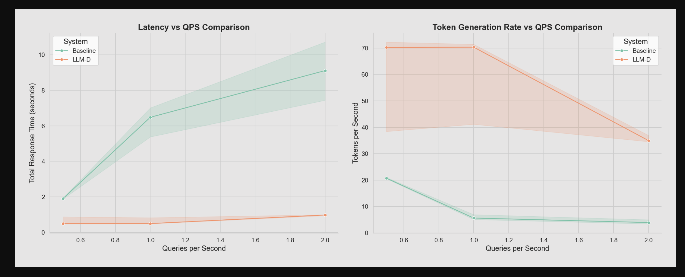

# Comparing Two LLM Deployments with llm-d-benchmark

This guide is an example of comparing LLM deployments (e.g., comparing a standalone vLLM model against an optimized llm-d stack).

The comparison consists of:

1. A benchmark job for the standalone LLM deployment (vLLM)
2. A benchmark job for the llm-d LLM deployment
3. An analysis job that automatically generates comparison plots and statistics

## Prerequisites

1. A running Kubernetes cluster
2. Two LLM deployments with accessible inference endpoints:
   - Standalone vLLM deployment
   - LLM-D optimized deployment
3. The `llm-d-benchmark` namespace created in your cluster

## Run evaluation jobs to compare a standalone model service (vLLM) and an llm-d model service

### 0. Setup Prerequisites

Create the required namespace, serviceaccount, and RBAC resources:

```bash
# run from quickstart-experiment-analysis folder
kubectl create namespace llm-d-benchmark
kubectl apply -f resources/sa.yaml
kubectl apply -f resources/rbac.yaml
```

### 1. Configure the Benchmark Jobs

The benchmark jobs are configured in [compare-stacks/benchmark-job.yaml](./compare-stacks/benchmark-job.yaml).
The compare-stacks environment is configured in the [compare-env](./compare-stacks/resources/compare-env.yaml) configmaps and
the [compare-workload-configmaps](./compare-stacks/resources/compare-workload-configmap.yaml).

### 2. Run the Benchmark Jobs

The benchmark jobs will create and monitor their respective evaluation jobs:

```bash
# Run both benchmark jobs
kubectl apply -f ./compare-stacks/benchmark-job.yaml

# Check logs for standalone job
kubectl logs -f job/standalone-benchmark-run -n llm-d-benchmark

# Check logs for llm-d job
kubectl logs -f job/llm-d-benchmark-run -n llm-d-benchmark
```

### 3. Run the Analysis Job

After both benchmark jobs and their evaluation jobs have completed, run the automated analysis:

```bash
# Run the analysis job
kubectl apply -f ./compare-stacks/compare-analysis-job.yaml

# Monitor the analysis job
kubectl get job compare-benchmark-analysis -n llm-d-benchmark -w

# Check analysis logs
kubectl logs -f job/compare-benchmark-analysis -n llm-d-benchmark
```

The analysis job will automatically:
- Load data from both `/requests/standalone/` and `/requests/llm-d/` directories
- Generate comparison plots and statistics
- Save all results to `/requests/analysis/`

### 4. Accessing the Analysis Results

After the analysis job completes, retrieve the results including plots and analysis:

```bash
# Create the retriever pod to access results
kubectl apply -f ./compare-stacks/retrieve-compare.yaml

# Wait for the retriever pod to be ready
kubectl wait --for=condition=Ready pod/results-retriever -n llm-d-benchmark --timeout=60s

# Copy all results including analysis to local machine
mkdir -p compare-results
kubectl cp llm-d-benchmark/results-retriever:/requests/ ./compare-results/

# Clean up the retriever pod
kubectl delete pod results-retriever -n llm-d-benchmark
```

You should now have the following structure locally:

```bash
$ ls -la compare-results/
standalone/  # Results from standalone vLLM deployment
llm-d/       # Results from llm-d deployment (includes analysis)

$ ls -la compare-results/standalone/standalone-vllm-llama-3b/
LMBench_long_input_output_0.1.csv
LMBench_long_input_output_0.25.csv
LMBench_long_input_output_0.5.csv

$ ls -la compare-results/llm-d/llm-d-llama-3b/
LMBench_long_input_output_0.1.csv
LMBench_long_input_output_0.25.csv
LMBench_long_input_output_0.5.csv

$ ls -la compare-results/llm-d/analysis/plots/
latency_comparison.png
throughput_comparison.png
qps_comparison.png
README.md
```

### 5. Viewing the Analysis Results

The analysis job automatically generates visual reports and a detailed README.md:

```bash
# List the generated analysis files
ls -la ./compare-results/llm-d/analysis/plots/
```

#### View README with grip (recommended)

[Grip](https://github.com/joeyespo/grip) renders Markdown files with GitHub styling for better visualization:

```bash
# Install grip if needed
pip install grip

# Generate HTML and view in browser (--browser opens it automatically)
grip compare-results/llm-d/analysis/plots/README.md --browser
```

### 6. Manual Analysis (Optional)

If you prefer to run the analysis manually or want to customize it, you can also run the analysis script directly:

```bash
# Run the comparison analysis on the collected results
python ./compare-stacks/compare-analyze.py \
  --standalone-dir ./compare-results/standalone \
  --llmd-dir ./compare-results/llm-d \
  --output-dir ./compare-results/manual-analysis
```

## Example Analysis Results

Visualizations generated by the analysis script:

### Latency Comparison

*This visualization shows key latency metrics between the standalone and optimized deployments, including time to first token, generation time, total response time, and token generation rate.*

### Throughput Comparison

*This visualization shows throughput metrics, including tokens per second and the relative performance improvement of the optimized deployment over the standalone.*

### QPS Performance Comparison

*This visualization shows how performance scales with increasing query load, including latency vs QPS and token generation rate vs QPS.*

## Cleanup

When you're done with the comparison, clean up the resources:

```bash
# Delete all comparison jobs
kubectl delete -f ./compare-stacks/benchmark-job.yaml
kubectl delete -f ./compare-stacks/compare-analysis-job.yaml

# Delete ConfigMaps
kubectl delete -f ./compare-stacks/compare-analyze-configmap.yaml

# Delete PVCs (this will delete all stored results)
kubectl delete pvc llm-d-results-pvc -n llm-d-benchmark
```
