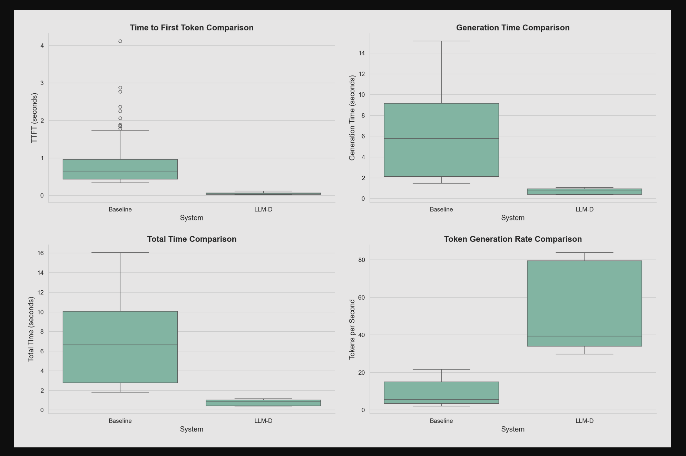
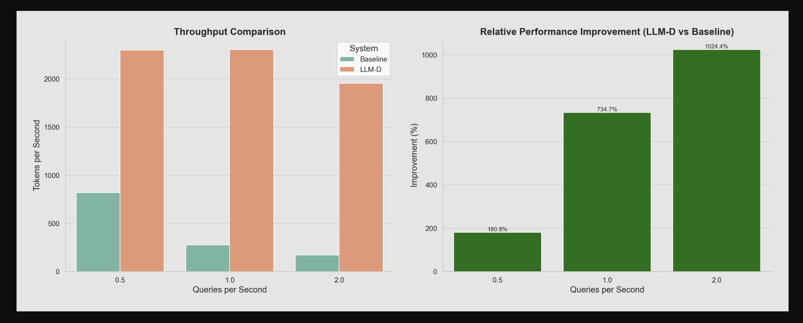

# Comparing Two LLM Deployments with FMPerf

This guide explains how to run benchmarks that compare two different LLM deployments (e.g., comparing a baseline model against an optimized version).
It uses [fmperf](https://github.com/fmperf-project/fmperf), specifically [fmperf's run_benchmark](https://github.com/fmperf-project/fmperf/blob/main/fmperf/utils/Benchmarking.py#L48)
The environment vars are configured via a [configmap](./resources//workload-configmap.yaml).

The comparison consists of:

1. A benchmark job for the first LLM deployment (baseline)
2. A benchmark job for the second LLM deployment (e.g., LLM-D)
3. Each benchmark job creates an evaluation job that runs the actual load testing

## Prerequisites

1. A running Kubernetes cluster
2. Two LLM deployments with accessible inference endpoints
3. The `fmperf` namespace created in your cluster

## Example Analysis Results

Here are examples of the visualizations generated by the analysis script:

### Latency Comparison

*This visualization shows key latency metrics between the baseline and optimized deployments, including time to first token, generation time, total response time, and token generation rate.*

### Throughput Comparison

*This visualization shows throughput metrics, including tokens per second and the relative performance improvement of the optimized deployment over the baseline.*

### QPS Performance Comparison

*This visualization shows how performance scales with increasing query load, including latency vs QPS and token generation rate vs QPS.*

## Run evaluation jobs to compare a baseline model service (vLLM) and an llm-d model service

### 0. Edit [workload-configmap.yaml](./resources/workload-configmap.yaml) and job definition to match your requirements.

Create the required PVCs, RBAC resources, and ConfigMap:

```bash
# run from quickstart-k8s folder
kubectl create namespace fmperf
kubectl apply --kustomize resources
kubectl apply compare-baseline-llmd/pvc-compare.yaml
```

### 1. Configure the Benchmark Jobs

The benchmark jobs are configured in [compare-baseline-llmd/compare-jobs.yaml](./compare-baseline-llmd/compare-jobs.yaml). Key configuration elements include:

#### Baseline Benchmark:
- **Service Endpoint**: Update `FMPERF_ENDPOINT_URL` with your baseline service endpoint
- **Model Configuration**: Set `FMPERF_WORKLOAD_FILE` to point to your baseline workload configuration
- **Stack Configuration**: Set `FMPERF_STACK_NAME` and `FMPERF_STACK_TYPE` for your baseline deployment
- **Results Directory**: Set `FMPERF_RESULTS_DIR` to `/requests` (mounted to baseline-results-pvc)

#### LLM-D/Optimized Benchmark:
- **Service Endpoint**: Update `FMPERF_ENDPOINT_URL` with your optimized service endpoint
- **Model Configuration**: Set `FMPERF_WORKLOAD_FILE` to point to your optimized workload configuration
- **Stack Configuration**: Set `FMPERF_STACK_NAME` and `FMPERF_STACK_TYPE` for your optimized deployment
- **Results Directory**: Set `FMPERF_RESULTS_DIR` to `/requests` (mounted to llm-d-results-pvc)

### 2. Run the Benchmark Jobs

The benchmark jobs will create and monitor their respective evaluation jobs:

```bash
# Run the benchmark jobs
kubectl apply -f ./compare-baseline-llmd/compare-jobs.yaml

# Monitor the jobs
kubectl get jobs -n fmperf baseline-fmperf-benchmark llmd-fmperf-benchmark -w

# Monitor the evaluation jobs
kubectl get jobs -n fmperf lmbenchmark-evaluate-* -w
```

### 3. Accessing and Analyzing the Results

After the benchmark jobs and their evaluation jobs have completed, create the retriever pod to access the results:

```bash
# Create the retriever pod
kubectl apply -f ./compare-baseline-llmd/retrieve-compare.yaml

# Copy results from both PVCs
kubectl cp fmperf/compare-retriever:/requests/ ./compare-results/

# upon successful copy, delte the retriever pod
kubectl delete pod results-retriever -n fmperf
```

You should now have the following locally and the equivalent in `compare-results/llmd`

```bash
$ ls -al compare-results/baseline/baseline-32b/
LMBench_long_input_output_0.1.csv
LMBench_long_input_output_0.25.csv
LMBench_long_input_output_0.5.csv
```

Now analyze the results using the comparison script:

```bash
# Run the comparison analysis on the collected results
python ./compare-baseline-llmd/analyze-compare-results.py \
  --baseline-dir ./compare-results/baseline \
  --llmd-dir ./compare-results/llmd \
  --output-dir ./compare-results/analysis
```

The script will create an `analysis` directory inside `compare-results` with:

- Comparative visualizations (latency, throughput, QPS)
- Statistics on performance improvements
- A README.md file explaining the plots

The README.md is generated using the `readme-analyze-compare-template.md` template, which provides a standardized format for understanding the benchmark results.

### 4. Viewing the Analysis Results

The analysis script generates several visual reports and a detailed README.md in the output directory:

```bash
# List the generated analysis files
ls -la ./compare-results/analysis/plots
```

#### View README with grip (recommended)

[Grip](https://github.com/joeyespo/grip) renders Markdown files with GitHub styling for better visualization:

```bash
# Install grip if needed
pip install grip

# Navigate to the plots directory
cd ./compare-results/analysis/plots

# Generate HTML and view in browser (--browser opens it automatically)
grip README.md --browser
```

The plots include:
- `latency_comparison.png` - Compares response time metrics between systems
- `throughput_comparison.png` - Compares throughput and shows relative improvement
- `qps_comparison.png` - Shows how each system scales with increasing load
